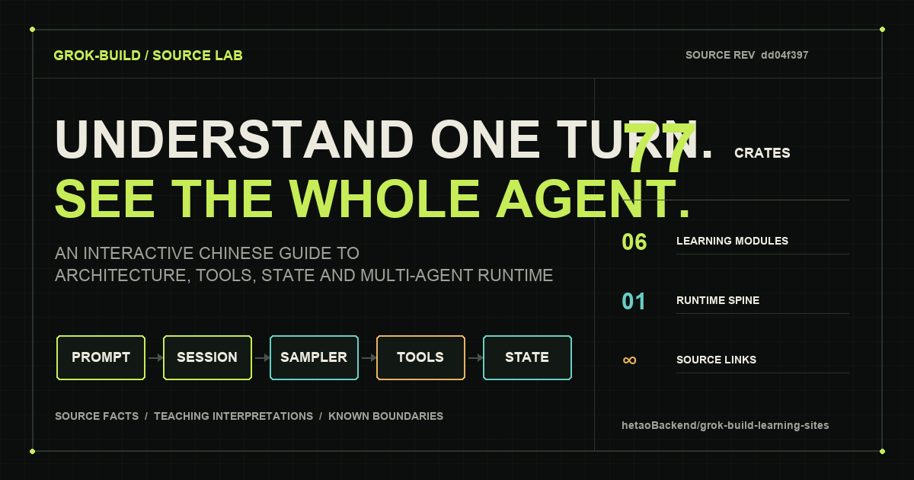

# grok-build Source Lab

[](https://github.com/hetaoBackend/grok-build-learning-sites/actions/workflows/ci.yml)
[](LICENSE)
[](https://github.com/xai-org/grok-build/tree/dd04f397b1d02f2272b092555669dfba1f01bc85)

一个面向工程师的中文交互式源码课程。沿着一次真实的 conversation turn，拆解 xAI [`grok-build`](https://github.com/xai-org/grok-build) 的 Session Actor、Sampler、工具安全、状态恢复、多界面适配和多 Agent 扩展机制。



> 这不是 README 翻译，也不是 77 个 crate 的平铺清单。每个专题都从可操作的运行路径出发，再回到固定版本的源码证据。

## 为什么做这个项目

`grok-build` 是一个体量较大、入口分散的 Rust monorepo。直接按目录逐个阅读，很容易记住许多类型和文件，却仍然回答不了几个关键问题：一次 Turn 在哪里开始和结束？为什么会话状态保持串行，而模型请求可以并发？工具调用在产生真实副作用前会经过哪些检查？进程退出、上下文压缩或 rewind 后，系统怎样继续工作？

这个项目把这些问题组织成一条可学习的主线：

```text
Prompt → Session Actor → Context → Sampler → Assistant Item
                                             ↓
                                         Tool Call
                                             ↓
                             Permission / Hook / Sandbox
                                             ↓
                                      Tool Result → loop
```

你可以先用交互图建立心智模型，再通过证据卡跳到对应 crate、文件和关键符号。

## 六个学习专题

| 专题 | 回答的问题 | 主要源码区域 |
| --- | --- | --- |
| [A · 架构地图](app/map/page.tsx) | 77 个 crate 应该从哪里开始读？ | binary entry、shell、sampler、tools、workspace |
| [B · Turn 生命周期](app/runtime/page.tsx) | 一次 Turn 如何从 Prompt 走到完成？ | session actor、request task、tool loop |
| [C · 工具与安全](app/tools-safety/page.tsx) | 副作用发生之前有哪几道门？ | plan mode、permission、hooks、sandbox |
| [D · 状态与恢复](app/state/page.tsx) | 会话为什么不会轻易失忆？ | event log、compaction、checkpoint、rewind |
| [E · 多界面](app/interfaces/page.tsx) | 一个内核如何服务五种外壳？ | TUI、headless、agent server、leader、ACP |
| [F · 扩展与多 Agent](app/extensions/page.tsx) | Skill、Plugin、MCP 和 Subagent 从哪里进入？ | prompt、discovery、events、tools、child session |

默认建议按 A → F 阅读；如果你正带着具体问题研究，也可以从任一专题独立进入。

## 内容为什么可信

课程固定在上游源码版本 [`dd04f397`](https://github.com/xai-org/grok-build/tree/dd04f397b1d02f2272b092555669dfba1f01bc85)，研究日期为 **2026-07-30**。页面中的技术陈述分成三类：

- **源码事实**：可以由固定 SHA 的代码直接验证。
- **教学解释**：为了建立心智模型，对多个实现点做的归纳。
- **已知边界**：源码明确存在的限制、fail-open、降级或回退行为。

安全相关内容不会只描述“有什么保护”，还会说明它没有覆盖什么。例如：Plan Mode 不等于 Bash/MCP 沙箱，Hook 处理器失败采用 fail-open，Subagent 请求 worktree 也不代表隔离一定成功。

源码基线和 permalink 生成逻辑位于 [`lib/content/source.ts`](lib/content/source.ts)，各专题证据位于 [`lib/content/`](lib/content/)。

## 本地运行

### 环境要求

- Node.js `>=22.13.0`
- npm（锁文件已提交）

```bash
git clone https://github.com/hetaoBackend/grok-build-learning-sites.git
cd grok-build-learning-sites
npm ci
npm run dev
```

打开终端输出的本地地址即可开始学习。

常用命令：

```bash
npm run dev      # 启动本地开发服务
npm run lint     # ESLint 检查
npm run build    # 构建 vinext 产物
npm test         # 构建并验证内容模型与全部学习路由
```

项目使用 React、TypeScript、Next.js API 与 [vinext](https://github.com/cloudflare/vinext)。课程数据保存在本地类型化模块中，不依赖账号或服务端数据库；学习进度仅保存在浏览器 `localStorage`。

## 项目结构

```text
app/                 首页与六个学习路由
components/          时间线、架构图、安全管线等交互组件
lib/content/         类型化课程数据、证据与源码 permalink
tests/               内容模型、渲染结果和站点契约测试
docs/superpowers/    设计规格与实施计划
public/              favicon 与社交预览资源
```

## 贡献

欢迎提交：

- 固定源码版本下的事实纠错或更精确的源码锚点；
- 更容易理解、但不牺牲边界条件的中文解释；
- 新的交互场景、无障碍与移动端改进；
- 上游版本变化后的差异研究。

开始前请阅读 [CONTRIBUTING.md](CONTRIBUTING.md)。技术纠错请尽量附上固定 commit 的文件、符号或行号，避免只引用会持续变化的默认分支。

如果这个项目能帮你更快理解 coding agent、Rust async runtime 或工具调用安全，可以点一个 Star，方便之后回来继续看新的源码版本和专题。

## 非官方声明

本项目是独立制作的社区学习项目，与 xAI 无隶属、赞助或官方认可关系。`Grok`、`grok-build` 及相关名称归其各自权利人所有。课程只引用公开源码并链接回上游固定版本，不包含或重新分发上游仓库源码。

## License

站点代码与原创课程内容采用 [MIT License](LICENSE)。上游 `xai-org/grok-build` 的代码及名称仍遵循其自身许可与权利声明。
